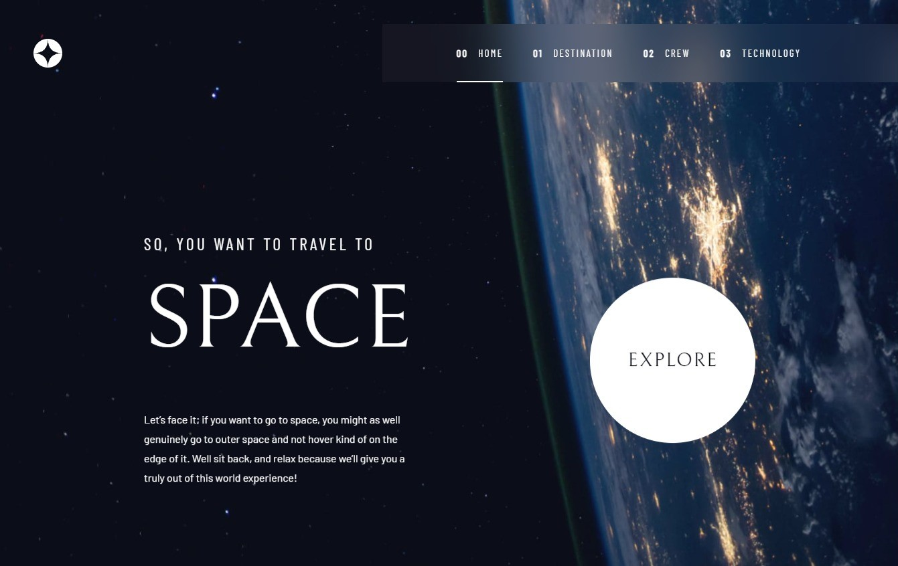

# <h1 align="center">Bem-vindo ao meu perfil! 😉👋</h1>
 
Olá, meu nome é <b>Matheus Nascimento da Silva</b>. Sou um <b>Programador Front-End</b> comprometido em transformar ideias de software em realidade, utilizando <b>criatividade</b> e garantindo qualidade com as melhores ferramentas <b>modernas</b>.
 
 
 

## HABILIDADES
Sou um programador focado no <i>front-end</i>, porém, para que minhas habilidades melhorem e alcance um maior nível comecei a entrar no mundo do <i>back-end</i>.

### Front end 🐱‍💻🐱‍💻

### Back end 🎲🎲

 
 
 
## 😄 SOBRE MIM

   Há dois anos ⏰, me deparei com o fascinante mundo da programação 🖥️ e decidi mergulhar nele. No começo, estava animado, mas logo enfrentei dificuldades e me questionei se era realmente isso que eu queria. Na época, estava empregado e todo tempo livre que tinha era dedicado ao aprendizado. Enfrentei muitos desafios por tentar absorver muita informação ao mesmo tempo. No entanto, insatisfeito com meu trabalho, ansiava por algo mais desafiador, algo que me fizesse crescer. Por isso, persisti na programação. Essa determinação me acompanhou até o momento em que decidi deixar meu emprego para me dedicar 100% ao desenvolvimento. E até hoje, continuo firme nessa jornada. ⛰️

 
 
 

## 🎯 MINHAS METAS

1. Encontrar minha primeira oportunidade de atuar na área.
2. Desenvolver minhas habilidades e trabalhar no exterior.
3. Criar minha própria empresa com minhas experiências e conhecimento.

 
 
 

## PRINCIPAIS PROJETOS

    

 
 
 

## CONTATE-ME

Linkedin: <a href="https://www.linkedin.com/in/matheusnsilva">link</a>

Portfólio: <a href="https://my-portfolio-alpha-ruby.vercel.app/">link</a>

Whatsapp: <a href="https://api.whatsapp.com/send?phone=5511978384169&amp;text=Olá,%20como%20vai?!">link</a>

